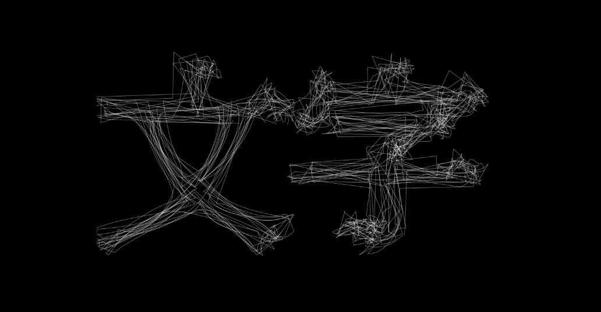

# glyphConstruct
opentype.jsを使用してフォントのアウトラインをapiで取得できるようにしたサンプル。



## apiからの戻り値サンプル
```
[
	{
		"path": [
			[
				"moveTo",
				[
					[
						341.5,
						499.5
					]
				]
			],
			[
				"curveTo",
				[
					[
						345,
						499.5
					],
					[
						346.5,
						495.5
					],
					[
						346.5,
						491.5
					]
				]
			],
			...
			[
				"closePath",
				[
					[]
				]
			]
		]
	}
]
```
